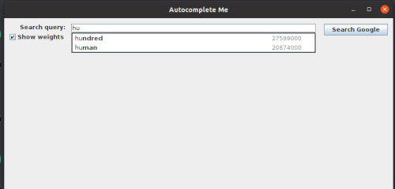

# Autocomplete
## Technologies and Libraries
<ul> 
<li> openjdk version 11.0.11 </li>
<li> Intellij Idea</li>
<li> algs4.jar </li>
<li> stdlib.jar </li>
</ul>

## How to Run the code
In order to run this code you need to make sure that the algs4.jar and the stdlib.jar files are in your java classpath. You can follow a tutorial on how to 
do this if you click on these links depending on your operating system.

<ul> 
<li>Linux : https://lift.cs.princeton.edu/java/linux/ </li>
<li>Windows : https://lift.cs.princeton.edu/java/windows/</li>
<li>Mac : Mac : https://lift.cs.princeton.edu/java/mac/ </li>
</ul>

Once these are in your classpath you can clone the repository with the following command

```
git clone https://github.com/PaulCardoos/Autocomplete.git
```

After you have successfully downloaded the repo and made sure your classpath includes stdlib.jar and algs4.jar, you can run the code like any other java program.

## Description 
This was an assignment completed for a course at the University of Massachusetts Boston while I was getting my bachelors degree. Autocomplete is part of many applications in the modern era of technology. Autocomplete predits how likely it is that the user is typing each query and presents like of the top matching queries. This project is implemented by sorting queries in lexigraphical order and then using a binary search to find the set of queries that start with a given prefix. The resulting set of matches is then sorted in descending order by their weight. The autocomplete functionality is implemented for each keystroke typed into the search bar. You can view this functionality in the section below.

## Visualizer


